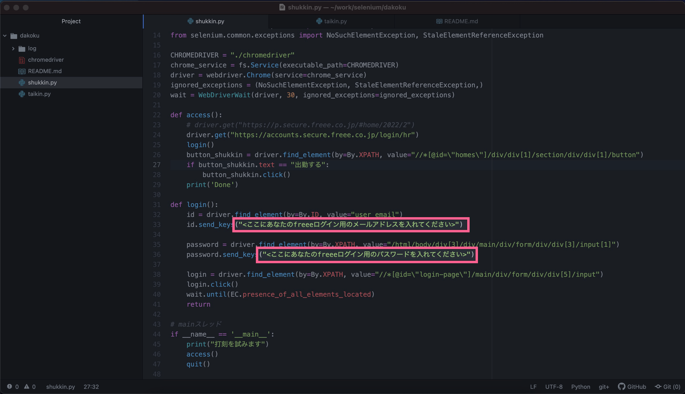
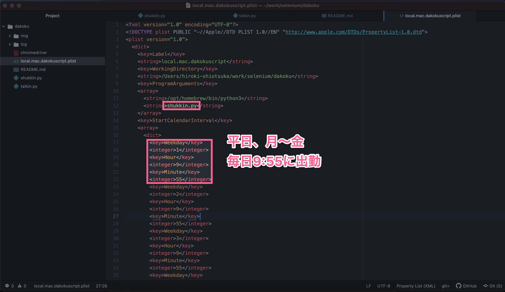

# bmon

## 1. 最新のchromedriverを落とす
https://chromedriver.chromium.org/downloads

## 2. Python

```bash
$ pip install selenium
$ mv ~/Downloads/chromedriver_mac64_m1.zip .
$ unzip chromedriver_mac64_m1.zip
```

## 3. 自分のfreeeアカウントのログイン情報を記載する


## 4. おもむろに出勤
`$ python shukkin.py`

## 5. おもむろに退勤
`$ python taikin.py`

## 6. スケジューラに登録したい場合

```bash
$ cp -p local.mac.dakokuscript.plist ~/Library/LaunchAgents/
$ sudo chown root ~/Library/LaunchAgents/local.mac.dakokuscript.plist
$ launchctl load ~/Library/LaunchAgents/local.mac.dakokuscript.plist
```
